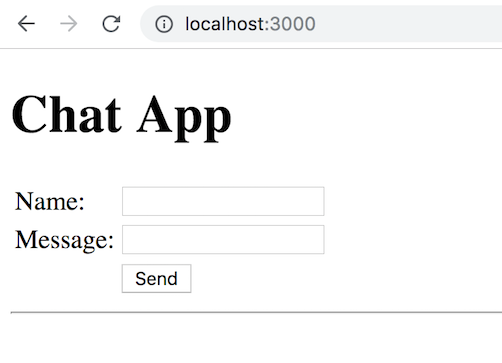
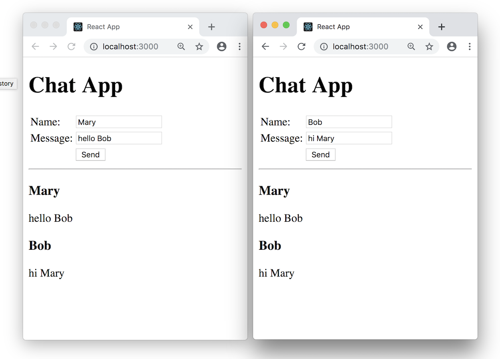
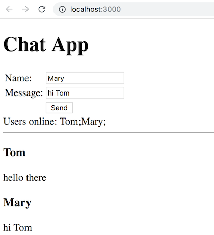
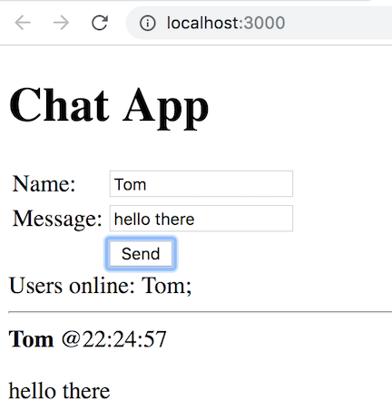

# React.js Exercise 6 – React ChatApp Component

> Complete ALL the exercises in this section. Ask thomas.devine@lyit.ie for help.

<!-- 
## Fetch latest Repository Branch

```
$ cd /DRIVE/xampp/htdocs/d3
$ git pull --no-edit https://github.com/noucampdotorgRESTAPI2020/ReactJS.git latest
$ git status

``` -->

> In a previous module we implemented a Chat App using jQuery and Node.js Express.  See [here](https://media.heanet.ie/page/2d9df49a25ae7b0f01f13cd0ecc6aa7c).  In this exercise we'll implement it as a React Component.

## Part 1 - Chat Server Setup

This simple ChatServer is used to get messages and post new messages for our ReactJS fetches.  

1.  Get the ChatServer [here](https://github.com/barcaxi/WD12020/tree/master/ReactJS/code).

1.	Open a Command Prompt window and change into the directory `ReactJS/chatServer`

    ```
    $ cd ReactJS/chatServer
    ```

    Setup the node_modules needed with:

    ```
    $ npm install
    ```

    and run the chatServer:

    ```
    $ node index.js
    ```

    Check it's working by using this URL [http://localhost:5000/get](http://localhost:5000/get) in your browser

1.  Open the source code in `index.js` & examine the code carefully.  Pay particular attention to the `messages` array.


## Part 2 - ChatApp

1.  Get the `<ChatApp` component from [here](https://github.com/barcaxi/WD12020/tree/master/ReactJS/code).

1.  Render the `<ChatApp>` component so you see this:

    

1.  Type your name and a few messages to see how it functions.

    Currently this component sends nothing and requests nothing from the Chat server.  We'll sort that in the next section.

1.	Open the source code in `ChatApp.js` & examine the code carefully.  Pay particular attention to new code for form event handling.


## Part 3 - ChatApp POST & GET

1.	In `ChatApp.js` uncomment the `fetch` command in `submit` method.

    This code posts any new message you type and send to the Chat server.

1.  Type and send a new message.  Then in a new browser window use this URL [http://localhost:5000/get](http://localhost:5000/get) again.

    You should see the message you sent returned to you.

1.  In the `componentDidMount()` method fetch any messages and update `state.messages` using `setState()`

1.  Modify the `<ChatApp>` component to fetch messages every 5 seconds.  Test it works.

1.  If everything is working you should be able to open TWO browser windows for the ChatApp and send messages to each other.

    


## Part 4 - Some Updates

1.  Use the Chat server to record the names of those users currently using the ChatApp and use the ChatApp to display them as show here:

    

    When recording users use the unique values input in the _Name_ textbox.

1.  When a user sends a message display the time of the message beside the user name as shown here:

    

    Get the time with this code:

    ```javascript
    var time = new Date().toLocaleTimeString();
    ```

